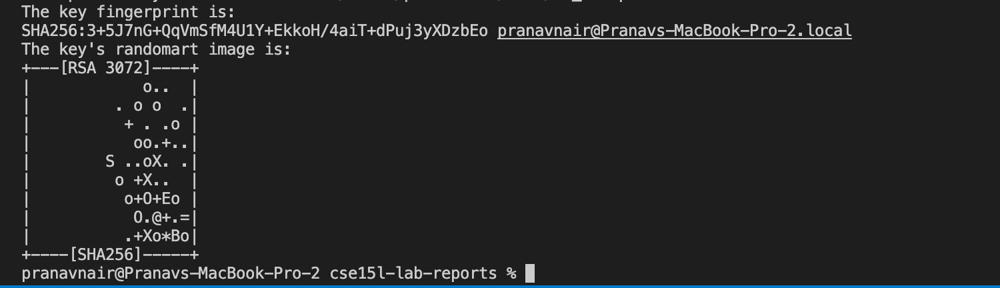
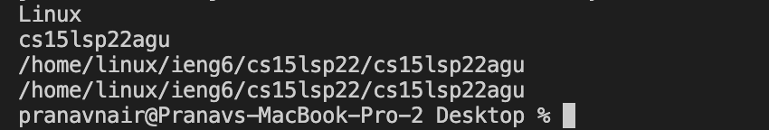

# Week 2 Lab Report

This lab report will contain a tutorial about how to log in to a course-specific account on `ieng6`. 

> Installing VScode

The first step is to install [Visual Studio Code](https://code.visualstudio.com/).

After installing and opening VScode, my screen looked like this:


While some differences may exist, everybody's starting page shou.d look relatively the same. 

> Remotely Connecting

I first looked up my course-specific account here:
https://code.visualstudio.com/

Everybody's username should start with `cs15lsp22`, and it will be followd by three letters.

The first step I took to remotely connect to the server is opening a terminal in VScode:


I then typed the following command:

`ssh <my_account_name>@ieng6.ucsd.edu`

Since it is my first time logging in, it asked me to confirm my log-in. After clicking "yes," I entered in my password (will not be visible when entering). The following output was part of what should be visible if the password is entered correctly:


I am now connected remotely!

> Trying Some Commands

Here are screenshots of my trying some commands on the remote computer.


Here are some other commands that can be tried:
* `ls -lat`
* `cd ~`
* `cp /home/linux/ieng6/cs15lsp22/public/hello.txt ~/`
* `cat /home/linux/ieng6/cs15lsp22/public/hello.txt`
* `mkdir <directory/file name>`

> Moving Files with `scp`

To try moving files using `scp`, I first created `WhereAmI.java` and typed the following:
```
class WhereAmI {
  public static void main(String[] args) {
    System.out.println(System.getProperty("os.name"));
    System.out.println(System.getProperty("user.name"));
    System.out.println(System.getProperty("user.home"));
    System.out.println(System.getProperty("user.dir"));
  }
}
```

After running this on my personal computer by using `javac` and `java`, I entered the following line in the terminal:

`scp WhereAmI.java <my_account_name>@ieng6.ucsd.edu:~/`

I then logged back in using `ssh`, and I ran the file on the remote computer. Here is the output:


> Setting an SSH Key

The purpose of this step is to set up a ssh key so that I won't need a password every time I log in. 

I entered the following on the client (not remotely connected):

`ssh-keygen`

`/Users/<user-name>/.ssh/id_rsa` (when asked which file to use to save the key)

(It will now ask for a passphrase, which should be left empty)

The following should be part of the output:



To copy the public key to the `.ssh` directory, I logged in and entered the following:

`mkdir .ssh`

`exit`

After I logout, I type in one last command:

`scp /Users/<user-name>/.ssh/id_rsa.pub <my_account_name>@ieng6.ucsd.edu:~/.ssh/authorized_keys`

A password isn't necessary to log in anymore. Try it out!

> Optimizing Remote Running

In order to speed up the process of remote running, here are some things I tired:

* Using commands inside quotes to directly run it on the remote server

`ssh cs15lsp22zz@ieng6.ucsd.edu "ls"`

* Using semicolons to run multiple commands

`scp WhereAmI.java <my_account_name>@ieng6.ucsd.edu, ssh <account> “javac WhereAmI.java”; ssh <account> “java WhereAmI”`

* Using the up arrow to access previous commands

These three tips helped me save time and keystrokes. 


 


