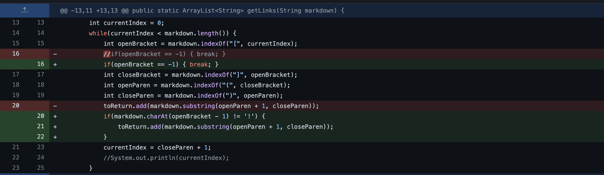
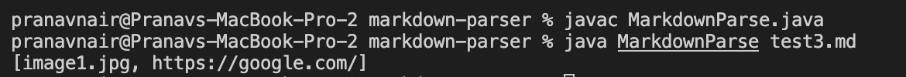
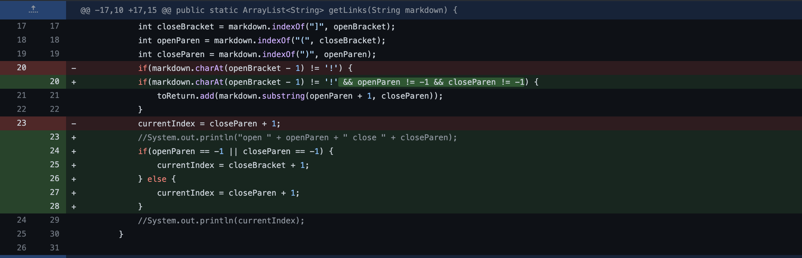
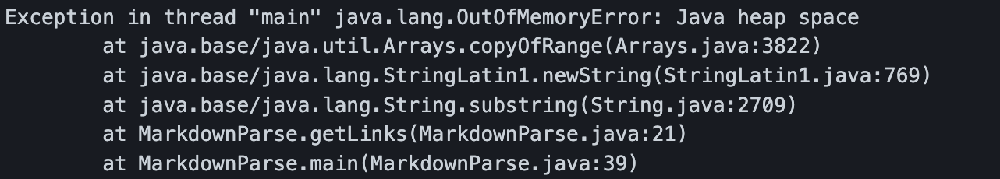
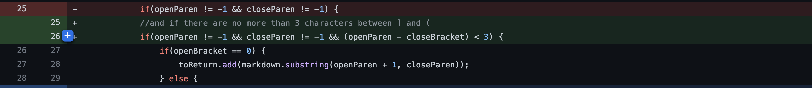
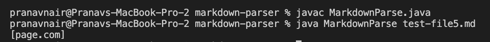

# Week 4 Lab Report

This lab report will focus on bugs and symptoms. Here are three examples of bugs and how they have been fixed.

> Example 1

The image below shows how the program was changed:

This test file prompted the change: [test-file](test3.md)

Here is the symptom of the failure-inducing input:

The failure-inducing input contained the link to an image. The bug doesn't differentiate an image link from a normal link, so the bug causes the link of the image to pop up as part of the output, which was the symptom. This bug was fixed by adding an if statement in the program to check for a "!" in the input. 

> Example 2

Here is the program change:

This test file prompted the change: [test-file2](testexample2.md)

Here is the symptom of the failure-inducing input:

The failure-inducing input contained a set of brackets that wasn't followed by a link. The bug in the program would cause the program to keep looking for a set of paratheses after the brackets, even when there weren't any. Thus, an OutOfMemory error occured, which was the symptom. 

> Example 3

Here is the program change:

This test file prompted the change: [test-file3](testexample3.md)

Here is the symptom of the failure-inducing input:

The failure-inducing output contained text in between the pair of brackets and pair of parantheses. Thus, the link between the paranthese isn't a valid link. However, the bug didn't recognize this, so the link was seen as a valid output when the program ran, which was the symptom. 

