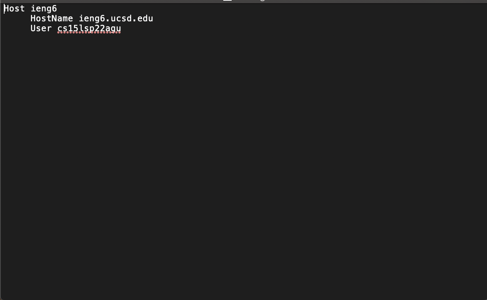
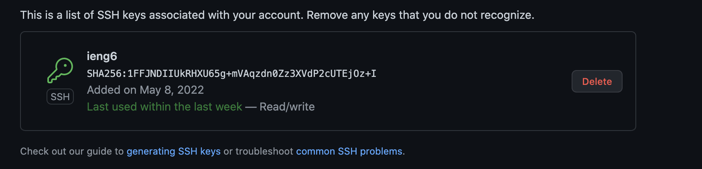

# Week 6 Lab Report

> Streamlining ssh Configuration

The goal of this task is to make the process of logging into ieng6 easier.

I first put an entry in `~/.ssh/config`. I added the following lines using Vim:

Here is how the config file looks after I was finished editing:

I then tried logging in using `ssh ieng6` (ieng6 is the alias I used in my config file).

This also can be used with the `scp` command to copy files:

> Setup Github Access from ieng6

The goal of this task is to be able to commit and push changes from the ieng6 server to the main branch on Github.

The command `ssh-keygen` was used once I logged in to my ieng6 account. This created a public/private key pair.

I then added the public key to Github.

I then went into the folder of the repository I want to work in and typed the following command:

`git remote set-url origin <repo ssh URL>`

To test if I can commit and push changes, I removed a file from the repository folder. The image below shows the commands I used to try to make sure I could correctly commit and push this change:

The link for the commit can be accessed [here](https://github.com/pnair03/sample-repo/commit/0e30749575484fe40767dcfccfc39cc49a781436).

> Copy whole directories with `scp -r`

The goal of this task is to copy subdirectories and directories instead of just files.

To do this, the `scp -r` command is used.

(Not all copied files are shown since there are far too many)

Command used: `scp -r . <account>:~/markdown-parse`

The command was used when the working directory was the markdown-parser folder on local device.

I next logged in to my ieng6 account to confirm that the command worked as intended. The image below shows that everything has been copied correctly, as the test file runs correctly:

The image below shows the command used to copy the necessary files and run the test file all in one line:

The `*.java` and `*.md` specify that only java and md files are copied. 
