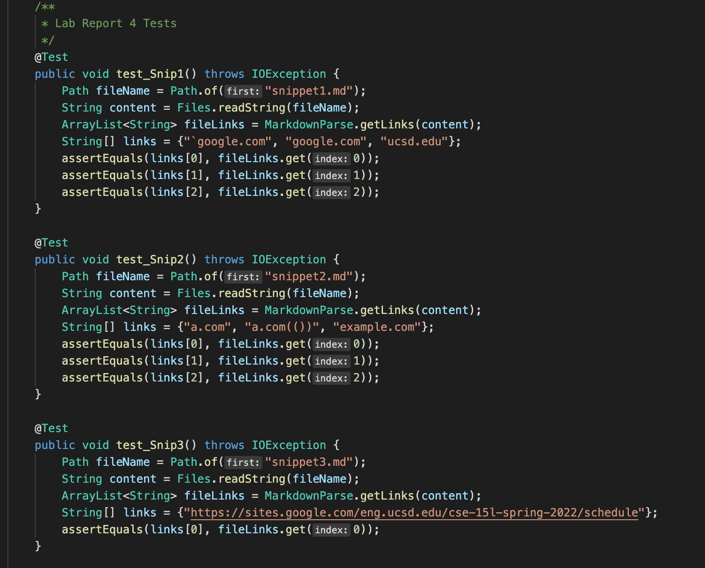
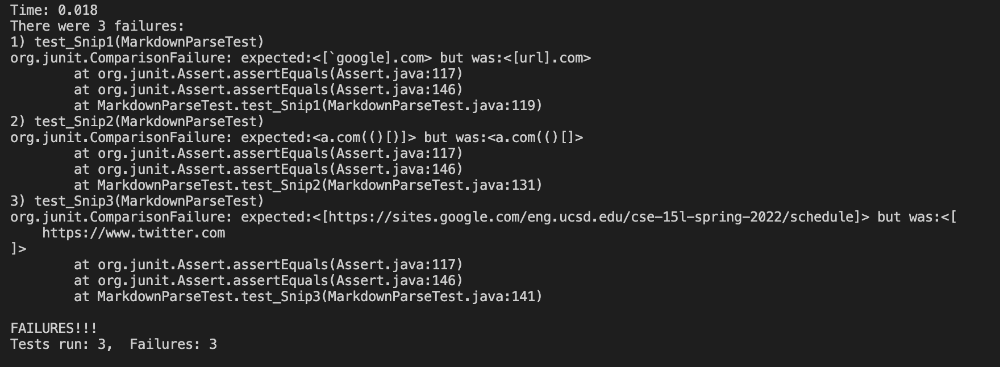
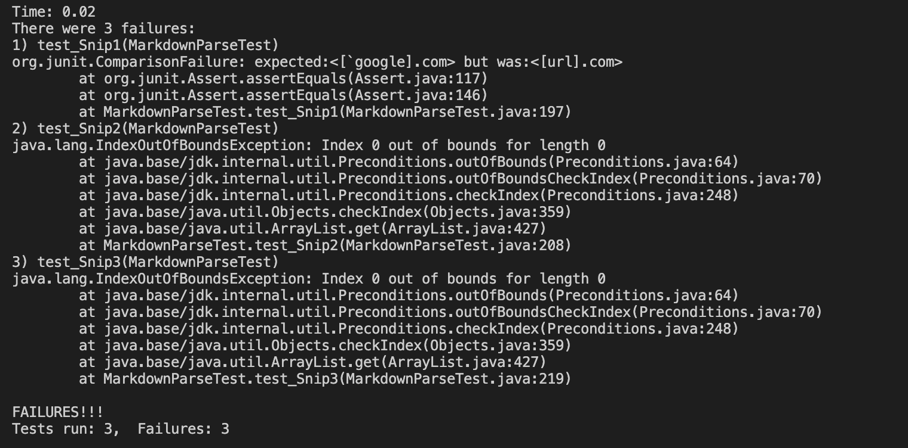

# Week 8 Lab Report

## Links to Repositories

* [Own Repo](https://github.com/pnair03/markdown-parser)

* [Reviewed Repo](https://github.com/anhthony/markdown-parser)

## Tests

The expected output for the first snippet should be the following:

> [`google.com, google.com, ucsd.edu]

The expected output for the second snippet should be the following:

> [a.com, a.com(()), example.com]

The expected output for the third snippet should be the following:

> [https://sites.google.com/eng.ucsd.edu/cse-15l-spring-2022/schedule]

Here are the tests used:

For my implementation, none of the tests passed. Here is the output produced: 

For the implementation that was reviewed, none of the tests passed as well. Here is the output produced:

## Answers to Questions

1. A small code change would need to occur so that the program will work on snippet 1. It shouldn't be a problem if backticks are located within the square brackets; this is why the program was able to add the last three links to the output. However, if statement needs to be used to check if there are any backticks located before the first opening bracket. If there are, then the link shouldn not be added.  

2. A more involved code change may need to happen for cases similar to snippet 2. The program would need to iterate through each character of the string to check for nested parantheses and brackets. Additionally, while the escaped-brackets case in this snippet works as intended (since they were inside the outside set of brackets), it may also need to be checked for other cases.

3. A small code change can help solve the issue for snippet 3. The program would just need to check for empty spaces and disregard them when figuring out what the output should be. This will likely solve the problem for all the cases that were presented in the snippet.  
