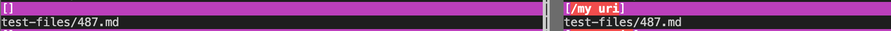
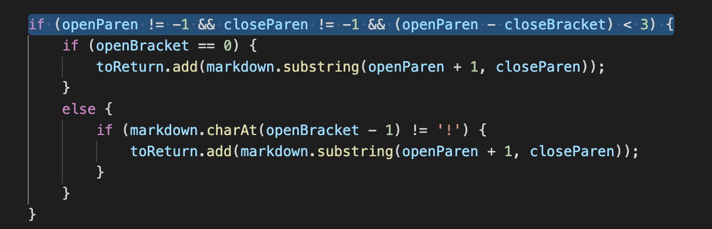

# Week 10 Lab Report

This lab report will go over experimenting with many tests at once.

The provided implementation had different results than y own implementation. 

The `vimdiff` comand was used to find the tests with different results.

Here are two test-files that had different results:

[Test File 1](https://github.com/pnair03/markdown-parser/blob/main/test-files/487.md)

[Test File 2](https://github.com/pnair03/markdown-parser/blob/main/test-files/488.md)

## Test File 1

The provided implementation is correct for this file. 

Actual outputs (provided implemenation on left, mine on right) :

Expected output: `[]` (no links should have been printed)

Bug with my implementation: the program includes the "/" as part of the link when it shouldn't. Thus, even though there aren't any links in the file, my implementation printed out "/uri" as a link. For this to be fixed, the code shown below should check for a "/" in an if-statement:

## Test File 2

My implementation is correct for this file.

Actual outputs:

Expected output: `[</my uri>]`

Bug with provided implementation: For the previous file, the program did not print out any links because it detected a "/". This happened with this file as well; however, it did not account for "<" and ">". For this to be fixed, the code shown below should check for those symbols:

